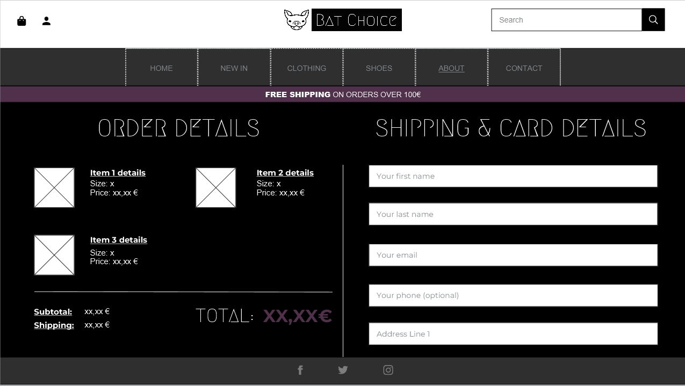
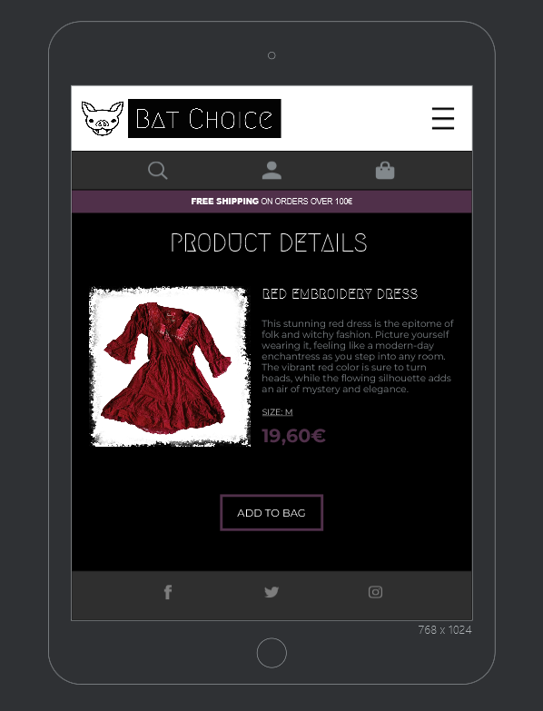

# Welcome to Bat Choice Clothing

## An alternative style online thrift store.

> It's a responsive e-commerce application with payment processing system, stock and User profile management. Created as a fifth Project Portfolio for Code Institute.


#### - By Karolina Piech

---

## Table of contents 

 1. [ E-Commerce ](#e-commerce)
 2. [ UX ](#ux)
 3. [ Agile Development ](#agile-development)
 4. [ Features implemented ](#features-implemented)  
 5. [ Features Left to Implement ](#features-left-to-implement)  
 6. [ Technology used ](#technology-used) 
 7. [ Testing ](#testing)  
 8. [ Bugs ](#known-bugs)  
 9. [ Deployment ](#deployment)
 10. [ Resources ](#resources)  
 11. [ Credits and acknowledgements ](#credits-and-acknowledgements)

---
## E-Commerce

### Purpose

Three core ideas behind BatChoice would be the following:

> Ease of use 

Simple and comfortable way for customers to browse through second hand gothic and alternative style clothing.

> Reliability 

Providing a single trustworthy and quality checked point for these pieces of clothing.

> Sustainability

Helping customers towards making good and enviromentally friendly fashion choices.

All of which combined, with a community focused on aestethic and quality, shall provide a standing ground for future growth. 
Possibly even into international spaces.

### Business Model and Marketing

#### Business Model

Bat Choice Clothing has a plan on providing sustainable high quality used and vintage alternative style clothes and footwear for our online customers.
Due to being a small online business and using a storage space based in Founder's private place the company would save on the high costs of renting a retail unit in a city. The savings generated through that would be spent towards better quality clothing sourced locally from thrift and vintage shops, flea markets, car boot sales, internet auctions (in some cases) and wholesalers.
Product pricing would vary between the items depending on their style, brand and condition. Providing users with a good reselling value by continous online research to ensure appropriate market price match and prevent overpricing will build the company's trust within the thrifting community and carefully curated collections will make it stand out amongst the competitors like Depop, Ebay or Amazon.
Business would mainly focus around female customers aged 16+, interested in goth, punk, emo and other styles within the wide spectrum of alternative fashion, music and lifestyle. After Bat Choice Clothing becomes a recognisable brand in the Internet, the product range would expand to include also male clothing and accessories to attract a broader audience. The "big picture" future plan includes engaging the local goth micro-brands to sell their arts and crafts on Bat Choice Clothing's website to share the spirit of creativity and upcycling.
With the goth and alternative community growing rapidly within the past few years altogether with society's increasing environmental awareness and vintage clothes simply being "in" there are high hopes for this company's big success.

#### Marketing

The initial starting points for getting grounded, would be advertising through various forms of Social Media. 
Obvious choices for visibility would be Facebook, Twitter, Instagram. However, spreading out and creating tendrils on other platfroms such as Tiktok would only help with visibility as well as providing website traffic and growth at a future date. 

Once a presence has been established on these platforms, and users have begun registering themselves to the site, we plan on keeping them informed and updated on everything Bat-Choice through a newsletter system. To avoid avoid coming across or being seen as spam, these 'newsletters' should be rolled out on a semi-regular basis. The key insights we would want to provide should show our users updates on currently stocked lines, seasonal discounting, stock highlights or even aspects of the growth/changes of the business and charity events and organisations supported by Bat Choice Clothing.


> Facebook page

The sample facebook page has been created at the following address: https://www.facebook.com/bat.choice.clothing
It includes basic information about company and posts related to the website.

Top of the page:


An example of a post with a goth meme created to encourage engagement with the brand's posts:


Post advertising a discount for fb followers:


> Twitter

Twitter example page can be found at the following address: https://twitter.com/BatChoiceClthg.
This account will mostly feature engagement posts and happy customers outfits.

View of the profile:


Engagement example post:


> Instagram:

Instagram profile has been created with the idea of advertising selected items, sharing outfit ideas, uploading happy customers photos etc. A sponsored co-operation with a thrift- loving influencers is an idea for a future advertisement on this platform. Link to the profile can be found here: https://www.instagram.com/batchoice.clothing/.

Profile page:


Happy customers outfits in stories:


Sneak-peak of a future drop:


Outfit idea featuring item available in store:


Post promoting selected item available in store:


##### [ Back to Top ](#table-of-contents)

---

## Database planning 


#### Data structure


#### Data models


##### [ Back to Top ](#table-of-contents)

---

## UX design


### Overview

In the initial phase of this project I designed a broad set of wireframes and mockups covering most of the features and screen sizes to help me decide on the structure, design and layout of the website before entering the coding stage. To help me with this task I used [Justinmind](https://www.justinmind.com/).

#### Design

> Name and Logo 

At first I needed to decide on the website's purpose, name and logo. As I wanted to create a goth/alternative online thrift shop, something related to the vampires, coffins or bats were the first things that came to my mind. In the end I chose to make the word play of "Bat Choice" and picked a bat's head as a part of the logo.
To design my logo I used a free logo maker available at https://app.logo.com/.

> Typography

I decided on using two main fonts available through Google Fonts:

- [Megrim](https://fonts.google.com/specimen/Megrim) for logo, headings and buttons
- [Montserrat](https://fonts.google.com/specimen/Montserrat) for the rest of the website.

> Colour palete

When you think of the word "goth" you most likely picture something dark and moody. And so is the colour palette I decided on. I used the mix of black, white, grey and my favourite shade of purple to summon the dark, yet feminine vibes.
To better visualise it I used [this colour palette generator](https://coolors.co/):


#### Site User

- A woman looking for an alternative clothing online store
- A person looking for sustainable clothing options available without leaving their house
- A teenage/ adult thrift store/ vintage lovers
- A person who likes goth fashion and aesthetic

#### Goals for the website

- To allow Users to browse through multiple clothing categories, so they can find the products they're interested in
- To help Customers access more sustainable clothing options
- To keep User's data safe
- To make the shopping process intuitive and simple, and to ensure that the payment system is secure
- To have a clear marketing strategy and good SEO
- To be accessible
- To answer potential questions raised by customers

### Wireframes

> Large to medium screens

- Homepage:


- Clothing:


- About:


- Contact us:


- Product details:


- Shopping bag:


- Checkout page:



- Login page:


- Sign up page:


- Profile page:


> Small screens

- Tablets:





- Mobile phones:


##### [ Back to Top ](#table-of-contents)

---

## Agile Development

### Overview

This project has been started alongside GitHub Projects to plan and track the workflow which would help me to manage the expected workload. After setting out the milestones and epics for my project I broke them down into a set of user stories and smaller tasks, which helped me monitor my progress and finish all of the mandatory features. Outside of user stories I also included separate issues for creating each module of this README file, to help me keep on track with documentation. To see the project's Kanban page please click [here](https://github.com/users/TulaUnogi/projects/4)


#### User Stories

Initial stage of the project included UX planning. I thought about the features and functionality I would expect from the first uses of the website and based on that I created a set of 14 User Stories. I labelled 12 of them as mandatory and the on, as they provide the core functionality and source of important informations for the User. The remaining 2 Stories are labelled as NINTH- Nice To Have, Not Important, as they provide some improvements, but are not necessary for the User to enjoy the website's base functionality. 

The User Stories include the acceptance criteria and are broken down into smaller, bite- size tasks that I would tick on completion, so I could easily track my progress. During the coding session I would record the encountered bugs, issues and solutions related to the Story in the comments below. Once all of the tasks in the Issue are completed I would move the User Story form "In progress" to "Completed" card in my project's Kanban.

> List of Mandatory User Stories

1. [USER STORY: Navigation](https://github.com/TulaUnogi/bat-choice-clothing/issues/19)
2. [USER STORY: User Profile](https://github.com/TulaUnogi/bat-choice-clothing/issues/20)
3. [USER STORY: Products display](https://github.com/TulaUnogi/bat-choice-clothing/issues/21)
4. [USER STORY: Product filtering and searching](https://github.com/TulaUnogi/bat-choice-clothing/issues/22)
5. [USER STORY: Shopping Basket](https://github.com/TulaUnogi/bat-choice-clothing/issues/23)
6. [USER STORY: Checkout](https://github.com/TulaUnogi/bat-choice-clothing/issues/24)
7. [USER STORY: About Us](https://github.com/TulaUnogi/bat-choice-clothing/issues/25)
8. [USER STORY: Contact form](https://github.com/TulaUnogi/bat-choice-clothing/issues/26)
9. [USER STORY: Newsletter](https://github.com/TulaUnogi/bat-choice-clothing/issues/27)
10. [USER STORY: Custom error pages](https://github.com/TulaUnogi/bat-choice-clothing/issues/28)
11. [USER STORY: Stock Management](https://github.com/TulaUnogi/bat-choice-clothing/issues/1)
12. [USER STORY: SEO](https://github.com/TulaUnogi/bat-choice-clothing/issues/37)

> NINTH: Not Important, Nice To Have

13. [USER STORY: Filtering by colour and size](https://github.com/TulaUnogi/bat-choice-clothing/issues/30)
14. [USER STORY: Change products grid](https://github.com/TulaUnogi/bat-choice-clothing/issues/29)

##### [ Back to Top ](#table-of-contents)

---

## Features implemented

1. [USER STORY: Navigation](https://github.com/TulaUnogi/bat-choice-clothing/issues/19)
2. [USER STORY: User Profile](https://github.com/TulaUnogi/bat-choice-clothing/issues/20)
3. [USER STORY: Products display](https://github.com/TulaUnogi/bat-choice-clothing/issues/21)
4. [USER STORY: Product filtering and searching](https://github.com/TulaUnogi/bat-choice-clothing/issues/22)
5. [USER STORY: Shopping Basket](https://github.com/TulaUnogi/bat-choice-clothing/issues/23)
6. [USER STORY: Checkout](https://github.com/TulaUnogi/bat-choice-clothing/issues/24)
7. [USER STORY: About Us](https://github.com/TulaUnogi/bat-choice-clothing/issues/25)
8. [USER STORY: Contact form](https://github.com/TulaUnogi/bat-choice-clothing/issues/26)
9. [USER STORY: Newsletter](https://github.com/TulaUnogi/bat-choice-clothing/issues/27)
10. [USER STORY: Custom error pages](https://github.com/TulaUnogi/bat-choice-clothing/issues/28)
11. [USER STORY: Stock Management](https://github.com/TulaUnogi/bat-choice-clothing/issues/1)
12. [USER STORY: SEO](https://github.com/TulaUnogi/bat-choice-clothing/issues/37)


##### [ Back to Top ](#table-of-contents)

---

## Features Left to Implement

13. [USER STORY: Filtering by colour and size](https://github.com/TulaUnogi/bat-choice-clothing/issues/30)
14. [USER STORY: Change products grid](https://github.com/TulaUnogi/bat-choice-clothing/issues/29)

##### [ Back to Top ](#table-of-contents)

---

## Technology used 

- Html 5 - for page structure
- CSS 3 - for custom styling
- Python 3- for the backend
- JavaScript - for Stripe Elements and contact form
- jQuery - for simplified JavaScript handling in templates
- Django - framework used to build this project
- Jinja - templating language rendering logic within html documents
- Bootstrap 4 - front end framework used by me alongside Django, helps with fast and efficient styling
- ElephantSQL - used as the database
- Font Awesome - for various icons used acrossed the website
- Google Fonts - for fonts used acrossed the website
- GitHub - for storing the code and for the projects Kanban
- Heroku - for hosting and deployement of this project
- Amazon Web Services (AWS) - hosting the static files 
- Git - version control tool
- Stripe - for making payments

##### [ Back to Top ](#table-of-contents)

---

## Testing

### Responsiveness

The website has been tested on multiple device sizes including:
- Manually: desktop, laptop (Lenovo Ideapad Gaming) and mobile phone (Xiaomi Redmi Note 12s)
- Online: various device sizes used by Chrome DevTools and [Am I Responsive? page](https://ui.dev/amiresponsive)

The responsiveness is good throughout the website.

Below you can see some results returned by [Am I Responsive? page](https://ui.dev/amiresponsive)

- Home page:


- Products page:


- About Us page:


### Code validation


##### [ Back to Top ](#table-of-contents)

---
 
## Known bugs 

The app is currently not finished yet, so there is no product management, User profile or Stripe payments present yet.

##### [ Back to Top ](#table-of-contents)

---

## Deployment

#### The deployment stage of the website should follow the steps below:

> Create the Heroku app

- Sign up / Log in to Heroku
- In Heroku Dashboard page select 'New' and then 'Create New App'
- Name a project - I decided on the bat-choice-clothing (the app's name must be unique)
- Select EU as that was my region in the moment of creating the app
- Select "Create App"
- In the "Deploy" tab choose GitHub as the deployment method
- Connect your GitHub account/ find and connect your GitHub repository

> Set up enviroment variables

- In the Django app editor create env.py in the top level
- In env.py import os
- In env.py set up necessary enviroment variables:
  - add a secret key using: os.environ['SECRET_KEY'] = 'your secret key'
  - in settings.py replace value of SECRET_KEY variable with os.environ.get('SECRET_KEY')
  - in settings.py change the DATABASES to:
  ```
  if "DATABASE_URL" in os.environ:
    DATABASES = {
            'default': dj_database_url.parse(os.environ.get("DATABASE_URL"))
        }
else:
    DATABASES = {
        'default': {
            'ENGINE': 'django.db.backends.sqlite3',
            'NAME': BASE_DIR / 'db.sqlite3',
        }
    }
  ```
- In Django app's settings.py on top of the file add:
```
from pathlib import Path
import os
import dj_database_url
if os.path.isfile('env.py'):
    import env
```

- Set up [Amazon AWS S3 bucket](https://aws.amazon.com/s3/)
- Install django-storages and boto3
- Navigate to the "Settings" tab in Heroku.
- Open the "Config Vars" section and add DATABASE_URL as Key and the database link as Value
- Add SECRET_KEY for the Key value and the secret key value from env.py as the Value
- Set variable "USE_AWS" to "True"
- Add AWS bucket "AWS_ACCESS_KEY_ID" and "AWS_SECRET_ACCESS_KEY" and set their values (downloaded from S3 AWS)
- In custom_storages.py:
```
from django.conf import settings
from storages.backends.s3boto3 import S3Boto3Storage


class StaticStorage(S3Boto3Storage):
    location = settings.STATICFILES_LOCATION


class MediaStorage(S3Boto3Storage):
    location = settings.MEDIAFILES_LOCATION

```
- In the terminal migrate the models over to the new database connection
- In settings.py add the STATIC files settings as follows:
```
STATIC_URL = '/static/'
STATICFILES_DIRS = (os.path.join(BASE_DIR, 'static'),)

MEDIA_URL = '/media/'
MEDIA_ROOT = os.path.join(BASE_DIR, 'media')

if 'USE_AWS' in os.environ:

    AWS_STORAGE_BUCKET_NAME = 'ckz8780-boutique-ado'
    AWS_S3_REGION_NAME = 'us-east-1'
    AWS_ACCESS_KEY_ID = os.environ.get('AWS_ACCESS_KEY_ID')
    AWS_SECRET_ACCESS_KEY = os.environ.get('AWS_SECRET_ACCESS_KEY')
    AWS_S3_CUSTOM_DOMAIN = f'{AWS_STORAGE_BUCKET_NAME}.s3.amazonaws.com'

    STATICFILES_STORAGE = 'custom_storages.StaticStorage'
    STATICFILES_LOCATION = 'static'
    DEFAULT_FILE_STORAGE = 'custom_storages.MediaStorage'
    MEDIAFILES_LOCATION = 'media'

    STATIC_URL = f'https://{AWS_S3_CUSTOM_DOMAIN}/{STATICFILES_LOCATION}/'
    MEDIA_URL = f'https://{AWS_S3_CUSTOM_DOMAIN}/{MEDIAFILES_LOCATION}/'
```
- Change the templates directory in settings.py to: TEMPLARES_DIR = os.path.join(BASE_DIR, 'templates')
- In TEMPLATES variable change the 'DIRS' key to look like this: 'DIRS': [TEMPLARES_DIR],
- Add Heroku to the ALLOWED_HOSTS list (the format will be your-app-name.herokuapp.com, you can copy it from the Domains section in Settings tab in your Heroku app)
- If you haven't done that up to this point, then create in your Django app's code editor new top level folders: static and templates
- Create a new file on the top level directory - Procfile, remembering to use a capital letter
- Within the Procfile add following:
```
web: guincorn PROJECT_NAME.wsgi
``` 
- In the terminal, add the changed files, commit and push to GitHub

> Heroku deployment

- In Heroku, navigate to the Deployment tab and deploy the branch manually 
- Heroku will display a build log- watch the build logs for any errors
- Once the build process is completed Heroku displays 'Your App Was Successfully Deployed' message and a link to the app to visit the live site

#### Forking the repository

By forking the GitHub Repository you can make a copy of the original repository to view or change without it effecting the original repository. You can do this with following steps:

- Log in to GitHub or create an account
- Enter this [repository link](https://github.com/TulaUnogi/bat-choice-clothing)
- Select "Fork" from the top of the repository
- A copy of the repository should now be created in your own repository

#### Create a clone of this repository

Creating a clone enables you to make a copy of the current version of this repository to run the project locally. To do this follow steps below:

- Navigate to https://github.com/TulaUnogi/bat-choice-clothing
- Click on the <>Code button at the top of the list of files
- Select the "HTTPS" option on the "Local" tab and copy the URL it provides to the clipboard
- Navigate to your code editor and in the terminal change the directory to your chosen location 
- Type "git clone" and paste the GitHub repository's link
- Press enter and git will clone the repository for you

##### [ Back to Top ](#table-of-contents)

---

## Resources

- [Code Institute Full Stack Development course materials](https://codeinstitute.net/global/full-stack-software-development-diploma/) 
- [Django documentation](https://www.djangoproject.com/)
- [Crispy forms docs](https://django-crispy-forms.readthedocs.io/en/latest/)
- [Bootstrap docs](https://getbootstrap.com/docs/5.0/getting-started/introduction/)
- [Stack overflow](https://stackoverflow.com/)
- [Slack](https://slack.com/intl/en-ie/)

##### [ Back to Top ](#table-of-contents)

---

## Credits and acknowledgements

> Pictures

- [cottonbro studio on Pexels](https://www.pexels.com/photo/woman-in-pink-dress-and-man-in-black-leather-jacket-standing-beside-brick-wall-10189421/) for 'founders'
- [freestocks.org on Pexels](https://www.pexels.com/photo/women-s-black-coach-212410/) for 'shop-new'
- [Sierra Koder on Unsplash](https://unsplash.com/photos/a-group-of-women-dressed-up-in-witches-costumes-IzBFvkhf_HI) for 'newsletter'
- [Robbie Noble on Unsplash](https://unsplash.com/photos/person-wearing-pair-of-black-leather-dress-shoes-on-gray-surface-hSygsHzG9ok) for 'shop-new'
-[Peter Gargiulo on Unsplash](https://unsplash.com/photos/a-black-and-white-photo-of-a-dark-background-cGNCepznaV8) for black background
-[Logo.com](https://app.logo.com/) for making a logo design much easier


> Code

- [Boutique Ado walktrough](https://github.com/Code-Institute-Solutions/boutique_ado_v1/tree/250e2c2b8e43cccb56b4721cd8a8bd4de6686546) from [Code Institute](https://learn.codeinstitute.net/) for the walktrough lessons on how to build an e-commerce web app
- [Lesson about using EmailJS](https://github.com/Code-Institute-Solutions/InteractiveFrontendDevelopment-Resume/tree/master/03-SendingEmailsUsingEmailJS/06-sending_emails) for other than Django approach to handling emails
- [Devin B. on Stack Overflow](https://stackoverflow.com/a/52417275/23072594) for admin 404 image error fix
- [crimsonpython24 on Stack Overflow](https://stackoverflow.com/a/63047180/23072594) for an idea on how to do a product count
- [Ashot Aleqsanyan on Stack Overflow](https://stackoverflow.com/a/56985340/23072594) for custom font integration for Stripe
- [ferrangb on Stack Overflow](https://stackoverflow.com/a/27458036/23072594) for generating username from email
- [Paolo Bergantino on Stack Overflow](https://stackoverflow.com/a/979538/23072594) for filtering items not older than a month (used for 'New In' products)
- [potts18 on Stack Overflow](https://stackoverflow.com/a/19131360) for an easy regex based solution to validate phone numbers
-[toraman on Stack Overflow](https://stackoverflow.com/a/48520908) for regex pattern used in my postcode validation


> Acknowledgements 

- Tutors:
    - Holly for helping me with Stripe orders not processing
    - Jason for helping with category sorting
    - John for helping with reviews saving and disappearing trash icon in bag
    - Oisin for spotting lacking .save() that was preventing products getting sold out
    - Sarah for helping with Internal Server Error for allauth in production
- My Mentor Narender Singh for all the patience and support

##### [ Back to Top ](#table-of-contents)
